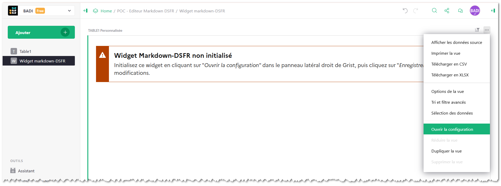
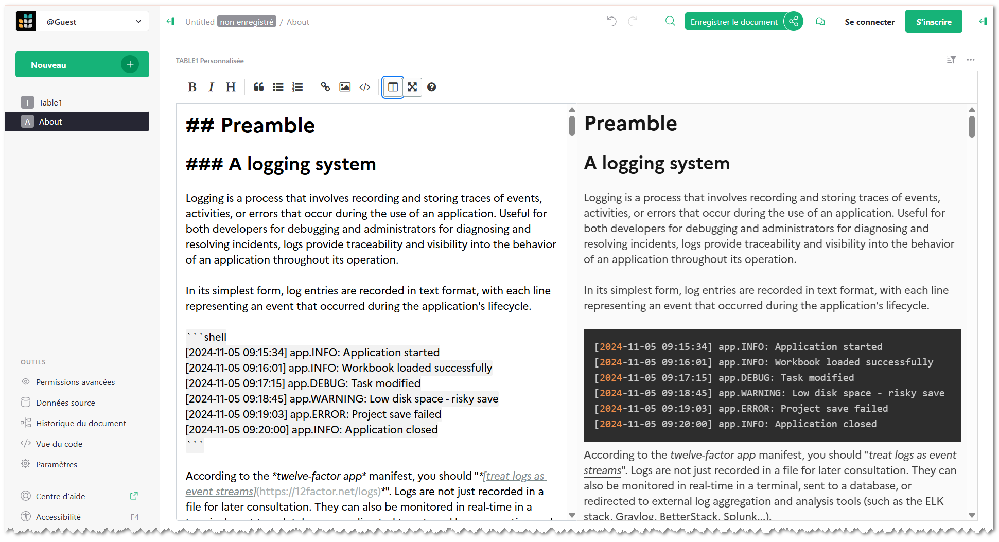
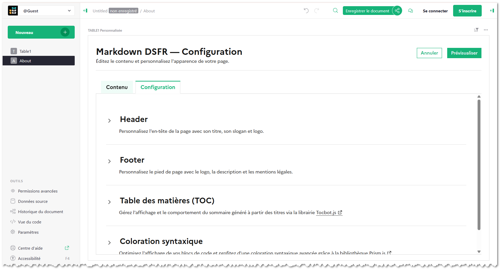
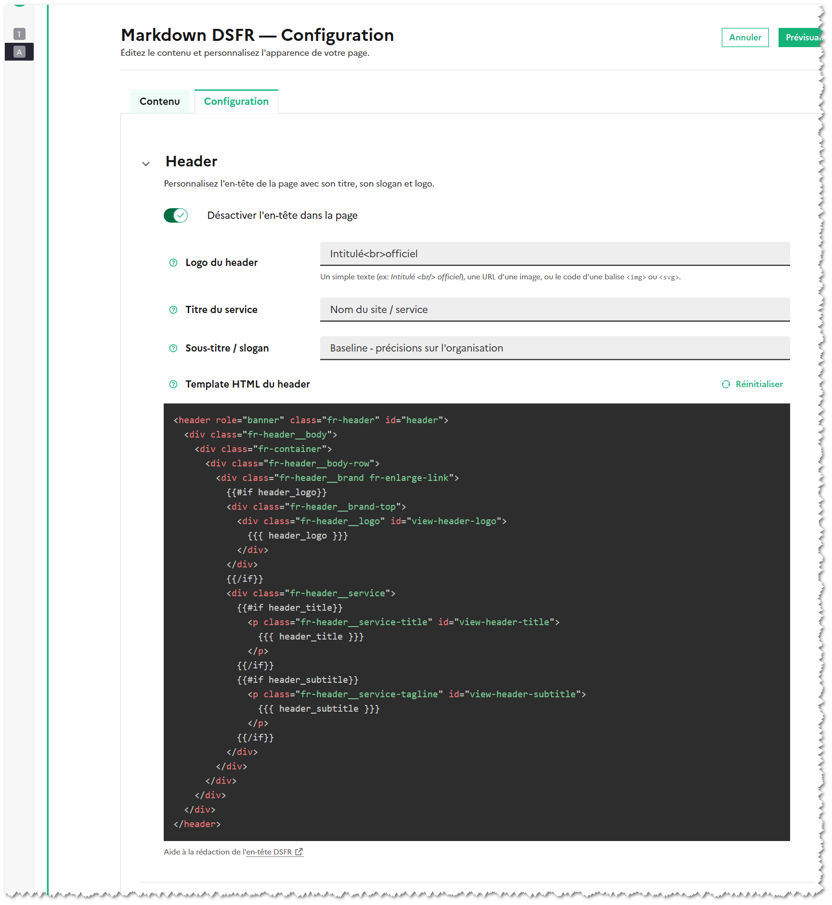
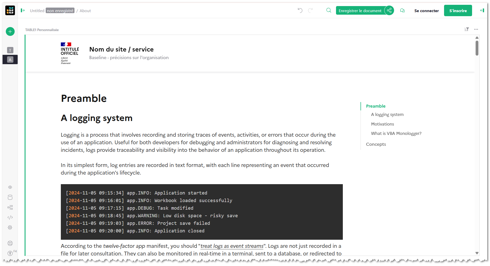
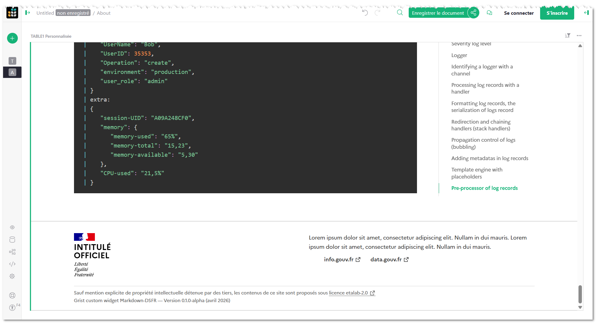

Grist widget Markdown DSFR
==========================

> ⚠️ Attention : Ce widget n'est pas encore finalisé. Il s'agit pour le moment d'un prototype toujours en cours de développement. **Il est fortement déconseillé de l'utiliser en production !** 

## Préambule

Ce widget **Markdown‑DSFR** a été conçu pour simplifier la création d’une page d'accueil, de présentation dans Grist, sans passer par l'édition de code HTML brut.

Il permet :

- De saisir le contenu directement en Markdown grâce à un éditeur WYSIWYG (*What‑You‑See‑Is‑What‑You‑Get*).
- D'obtenir, en quelques clics, un rendu de page conforme au Design System de l'État (DSFR).
- De configurer le rendu final (en-tête, pied de page, sommaire, coloration syntaxique du code)

> 🔗 Accéder au widget (URL)
>  - https://aot-dep-badi.github.io/grist-custom-widget-markdown-dsfr/

## Fonctionnalités

### Rédaction du contenu Markdown

Dans le panneau de configuration du widget, un éditeur *What‑You‑See‑Is‑What‑You‑Get* vous invite à écrire votre texte en Markdown.
Le texte est instantanément converti en HTML via la librairie **markdown-it**. Il est possible d’écrire en markdown directement ou bien d’utiliser certaines balises html (et notamment les composants DSFR directement). Les sauts de ligne sont éagelement respectés.

### Options de configuration (back-end)

Dans l'onglet configuration, plusieurs options sont disponibles pour personnaliser le rendu final.

| Option | Description | Exemple d’utilisation |
|--------|------------|-----------------------|
| **Header DSFR** | Active ou désactive l’en‑tête officielle ; vous pouvez personnaliser le logo, le titre du service, le slogan et même remplacer entièrement le HTML via un mini‑éditeur Handlebars. | `{{{ header_logo }}}`, `{{{ header_title }}}` |
| **Footer DSFR** | Idem pour le pied de page ; variables disponibles pour le logo, la description, la licence, le copyright, ou un HTML complet. | `{{{ footer_logo }}}`, `{{{ footer_license }}}` |
| **TOC (Table des matières)** | Génère automatiquement un sommaire à partir des titres Markdown ; vous pouvez choisir le texte du titre du sommaire, son affichage, et la palette de couleurs via **tocbot.js**. | `{{{ toc_title }}}` |
| **Coloration syntaxique** | Applique le thème Prism‑Tomorrow aux blocs de code, garantissant une lecture claire et un aspect conforme aux standards DSFR. | `<pre><code class="language-js">…</code></pre>` |

> Chaque option possède un **bouton d’aide** (icône « i ») qui ouvre un tooltip détaillant le rôle de la variable et les bonnes pratiques.

Par exemple, pour la configuration du header

### Rendu final (front-end)

Une fois la configuration enregistrée et le bouton **Prévisualiser** activé, le widget produit une page HTML intégrant :

* le **header** DSFR (ou sa version personnalisée) ;
* le **contenu** Markdown transformé, avec titres, listes, images et blocs de code stylisés ;
* la **table des matières** collante sur le côté gauche (ou en haut ; réglable) ;
* le **footer** DSFR (ou sa variante sur‑mesure).

> Le design reste 100% compatible avec les exigences d’accessibilité et de responsive design du DSFR.

## À propos

### Vous souhaitez contribuer ?

Les idées, les rapports de bugs, les signalements de fautes de frappe dans la documentation, les commentaires, les pull-requests et les étoiles GitHub sont toujours les bienvenus !

### Licence

Publié sous [Licence MIT](https://www.google.com/search?q=./LICENSE),
Copyright (c) 2026 Académie Orléans-Tours, Bureau analyse et développement informatique
